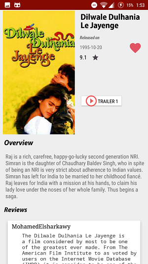

# Popular Movies

Popular Movies is a project app under Udacity's "Android Developer 1 Nanodegree Program ".
This app will allow the users to discover the most popular movies , top rated movies and adding their own favourite movies list.

### Screenshots

  
  
  

### Walkthrough

### Requirements

1. API key from http://www.themoviedb.org
    if you dont have one, create an account and register for Developer option API key

### Procedure

1. Download the code from repository
2. Move into gradle.properties in your project
3.Provide your API key in API_KEY string

### References

1. Udacity Nanodegree Course
2. Android developer website (https://developer.android.com/index.html)
3. Stackoverflow
